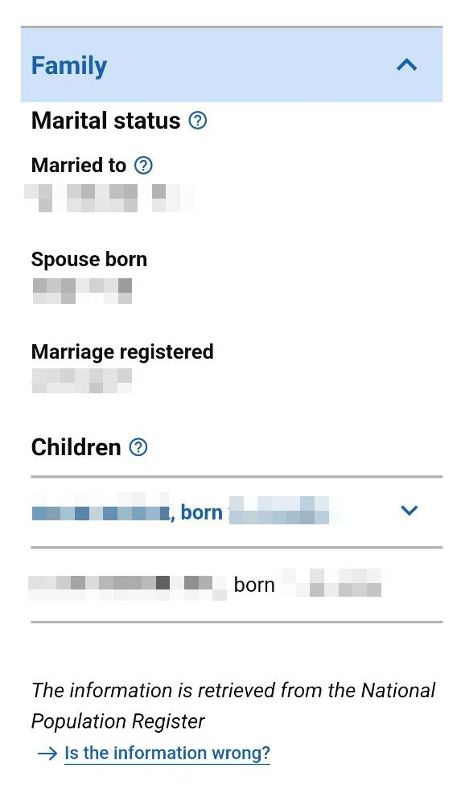
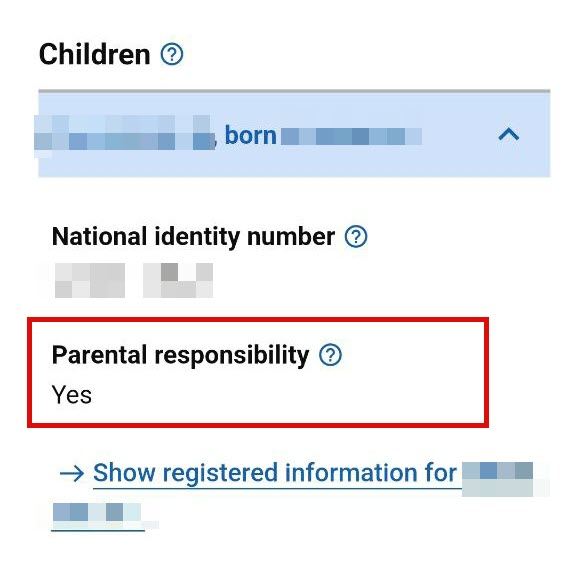

---
hide:
  - navigation
  - toc
---

## Зачем нужна регистрация родительской отвественности? { #hvorfor }

В Норвегии родители должны иметь закреплённую _родительскую ответственность_ ([_foreldreansvar_](https://www.skatteetaten.no/person/folkeregister/fodsel-og-navnevalg/barn-fodt-i-utlandet/foreldreansvar-for-barn-fodt-i-utlandet/)) за своими детьми в национальном реестре населения (_Folkeregisteret_). Родительская ответственность дает право принимать решения от имени вашего ребенка. 

В реестре регистрируется кто из родителей имеет родительскую ответственность. Родительская ответственность может возлагаться на одного из родителей или быть совместной. 

Отсутствие родительской ответственности влечет за собой проблемы в практических вопросах, таких, как например покупка рецептурных лекарств (выписанных на ребенка), регистрация переезда ребёнка внутри страны ("прописка"), открытие счета в банке и заказ банковской карты для ребенка, выбора школы, возможности смотреть медицинские данные на ребенка в Helsenorge.

Родительская ответственность может быть либо совместной между двумя родителями, либо единоличной.

## Как проверить наличие родительской отвественности? { #sjekke-foreldreansvar }

Национальный реестр населения администрируется налоговой Норвегии (_Skatteetaten_).

Для проверки наличия родительской ответственности онлайн вам нужно иметь электронный идентификатор MinID или BankID / Buypass ID. 

1. [Перейдите на сайт Skatteetaten](https://www.skatteetaten.no/person/), выберите «Folkeregister», и далее «Mine opplysninger i Folkeregisteret».

2. После входа, нажмите на заголовок “Familie” (Семья) для открытия информации про семейное положение и детей. Вы будете видеть информацию схожую со скриншотом ниже.

3. На скриншоте ниже вы видите пример родителя с двумя детьми. Родительская ответственность зарегистрирована только на одного из детей. У детей, на которых есть родительская ответственность, имя и дата рождения выделена синим цветом. Нажав на имя ребенка, можно посмотреть дополнительную информацию. Если родительская ответственность отсутствует, то в реестре вы будете видеть только имя и дату рождения в черном цвете.

    {: style="width:350px"}

4. При просмотре дополнительной информации про ребенка, то в графе «Foreldreansvar» написано __Ja__ если у вас есть родительская ответственность на ребенка. 

    {: style="width:350px"}

## Кто должен оформить соглашение о родительской отвественности? { #hvem-maa-registrere }

Если у вас родительская ответственность значиться в Folkeregisteret как _неизвестная_, то вам нужно определить родительскую ответственность. Об этом вам может также прийти письмо из Skatteetaten c просьбой предоставить информацию о родительской ответственности.

??? info "Пример письма (на английском)"

    {: style="width:600px"}

Родительская ответственность будет значиться как _неизвестная_, если

- родители не состоят в браке, или
- только один из родителей переехал в Норвегию с ребенком

Если родители состоят в браке, и приезжаете в Норвегию __вместе__, то обычно родительская ответственность регистрируется как совместная в Folkeregisteret, и никаких действий предпринимать не нужно. _Это не гарантия_, так как это зависит от многих факторов, в том числе какую информацию имеют миграционные власти (в лице UDI) и передают в Skatteetaten.

## Что нужно представить для регистрации родительской ответственности? { #dokumenter }

Одно из следующих документов:

Один из следующих документов:

- Заполненное соглашение о родительской ответственности (см. подробнее ниже).
- Решение UDI о том, кто несет родительскую ответственность.
- Решение суда в Норвегии о том, кто должен нести родительскую ответственность.
- Решение суда страны, являющейся участником Конвенции Совета Европы или Гаагской конвенции. Украина является участником обеих конвенций.

## Соглашение о родительской отвественности { #veiledning } 

### Бланк соглашения { #skjema }

Скачать бланк соглашения о родительской ответственности (норв. _avtale om foreldreansvar_):

[Agreement for parental responsibility (regjeringen.no)](https://www.regjeringen.no/en/find-document/dep/BLD/skjema/skjema-2/agreement-for-parental-responsibility/id437436/){ .md-button }

Бланк формы распечатывается и заполняется от руки разборчивым почерком.

### Если в Норвегии только один из родителей ( #foreldreansvar-alene }

Родительская ответственность не может быть зарегистрирована на родителя, который не находиться в Норвегии. Регистрация совместной родительской ответственности, где один из родителей не находиться в Норвегии, невозможно (cм. [Barnelova § 39](https://lovdata.no/lov/1981-04-08-7/§39)). Иными словами, можно только оформить соглашение о единоличной родительской ответственности родителя, который находиться в Норвегии.

Бланк соглашения о родительской ответственности разделен на три части, см. иллюстрацию ниже. Вступительная часть касается информации про ребенка (полное имя, адрес, и национальный идентификационный номер – fødselsnummer, если он, на момент оформления соглашения уже получен).

Далее идет так называемая часть 1 и часть 2, которая пронумерована. Часть 1 касается тех, кто хочет оформить совместную родительскую ответственность (об этом позже). В ситуации когда в Норвегии только один из родителей, нас интересует часть 2, в которой идет речь о соглашении о единоличной родительской ответственности. 

{: style="width:600px"} 

Первый ряд во части 2 предназначено для родителя, который будет нести родительскую ответственность. Второй ряд для родителя, который не будет иметь родительскую ответственность (находиться за границей). Если отец ребенка, например, в Украине, нужна подпись отца. Если родители разведены, то нужно приложить документы, что опека в Украине на матери. 

К анкете прилагается копия действительных подтверждающие личность документов родителей (паспорт), свидетельство о рождении, и в случаях, где актуально: так же иных документов (например, свидетельство о браке, решения суда). У вас могут запросить апостиль на некотырые из представленных документов.  

Если один из родителей (например отец) лишен родительский прав решением суда в Украине, то обычно у вас попросят предоставить оригинал решения суда на украинском с проставленном апостилем в Украине, а также перевод решения суда на английский или норвежский. 

### Если в Норвегии находится оба родителя { #felles-foreldreansvar }

Отличия от соглашения о единоличной родительской ответственности является заполнение части 1 бланка (вместо части 2).

В верхнем ряде в части 1 указывается дата, и место подписи (например, если вы находитесь на момент подписания в городе Осло, вы пишите: _Oslo, 03.02.2024_). Во втором и третьем ряде указывается полное имя первого и второго родителя, и их fødselsnummer (при наличии).

## Адрес, куда отправить соглашение о родительской ответственности

Заполненное соглашение вместе с документами отправляется обычной почтой по адресу:

!!! info ""
    <pre>
    Skatteetaten
    Postboks 9200 Grønland
    0134 Oslo
    </pre>

## Изменить родительскую ответственность электронно { #endre-foreldreansvar-elektronisk }

_Изменить_ родительскую ответственность электронно возможно, если:

- Вы зарегистрированы как родитель ребенка
- У вас есть родительская отвественность на ребенка 
- Оба родителя в Норвегии и имеют национальный идентификационный номер - fødselsnummer

[В таком случае вы можете изменить ее электронно по ссылке](https://skatt.skatteetaten.no/web/minfolkeregisterside/?opprett=foreldreansvar).

Это актуально, если только один из родителей имеет родительскую ответственность, и нужно оформить совместную, или наоборот. 

## Источники

> :material-book-outline: __Источники__
>
> Законодательство
>
> [Barnelova. Kapittel 5. Foreldreansvaret og kvar barnet skal bu fast](https://lovdata.no/dokument/NL/lov/1981-04-08-7/KAPITTEL_6#KAPITTEL_6)
> 
> Официальные сайты
>
> - [Foreldreansvar (Skatteetaten)](https://www.skatteetaten.no/person/folkeregister/fodsel-og-navnevalg/foreldreansvar/)
> - [Foreldreansvar for barn født i utlandet (Skatteetaten)](https://www.skatteetaten.no/person/folkeregister/fodsel-og-navnevalg/barn-fodt-i-utlandet/foreldreansvar-for-barn-fodt-i-utlandet/)
> - [Foreldreansvar (regjeringen.no)](https://www.regjeringen.no/no/tema/familie-og-barn/innsiktsartikler/foreldreskap/foreldreansvar/id749199/)
