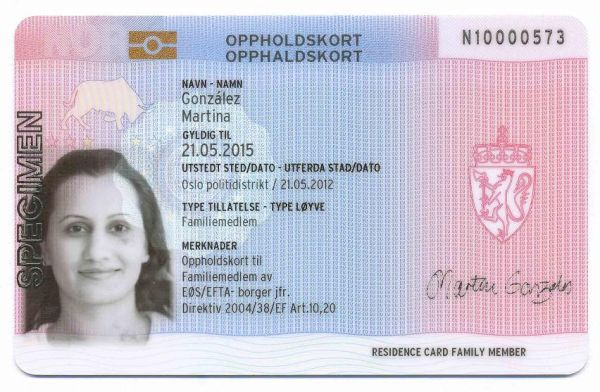

??? question "Свидетельство просителя убежища ("Желтая карта")" 

    {: style="width:300px", align=left } 

    После подачи заявления о защите в Норвегии, вы получаете карту, подтверждающую, что вы являетесь просителем защиты (норв. [_Registreringsbevis for asylsøker_](https://www.udi.no/ord-og-begreper/asylsokerbevis/)). Свидетельство не является удостоверением личности и не дает права на работу в Норвегии. Свидетельство документирует ваше право нахождения в Норвегии на время рассмотрения заявления о защите.

??? question "Карта резидента Норвегии ("синяя карта")"

    {: style="width:300px", align=left } 

    Карта резидента Норвегии (норв. [_oppholdskort_](https://www.udi.no/ord-og-begreper/oppholdskort/)) документирует что у вас есть разрешение на проживание в Норвегии. Вы получаете карту через определенное время после получения коллективной защиты.

    Карта резидента не является удостоверением личности, а идет в связке с загранпаспортом как дополнение к нему. Если вы собираетесь выехать из Норвегии, у вас должен быть на руках
    [действующий загранпаспорт и карта резидента](https://www.udi.no/viktige-meldinger/har-du-planlagt-a-reise-til-utlandet/). 

??? question "Решение IMDI о определении в коммуну"

    {: style="width:300px", align=left } 

    Это письмо информирует вас о том, что IMDi (Директорат по интеграции и культурно-этническому разнообразию) вынесло решение о закреплении вас за определенной коммуной. Данное решение не может быть обжаловано, решение об этом является окончательным и обжалованию не подлежит. Отказ от коммуны может означать, что вы можете потерять право на интродукционную программу (для тех, кто между 18 и 55 лет). 